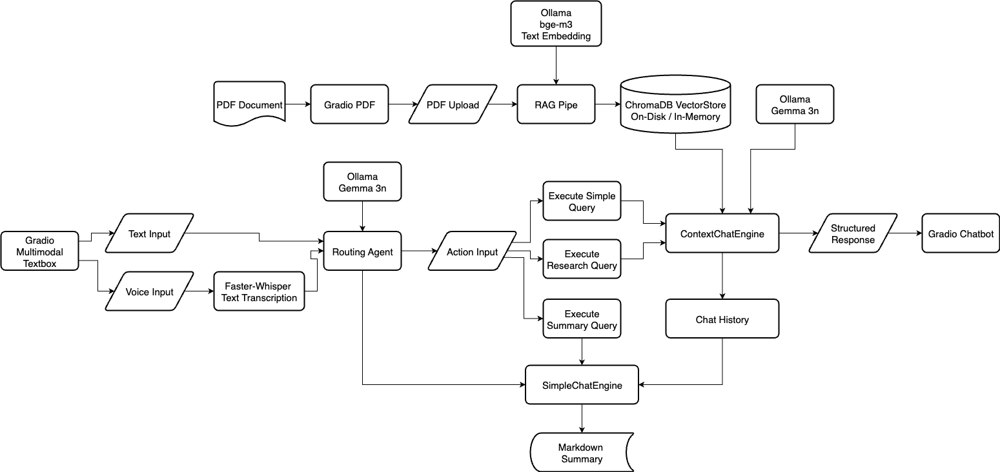

# 🔬 Research Companion | Gemma 3n Impact Challenge | Google DeepMind Hackathon (Kaggle)

A `Multimodal`, `Conversational AI` research assistant powered by **Google's Gemma 3n**. This tool allows users to upload complex technical papers and engage in a natural dialogue to understand key concepts, simplify equations, and accelerate their research process.

## Features
- **Document Q&A:** Upload a PDF and ask direct questions about its content.
- **Concept Explanation:** Ask the AI to explain complex topics from the paper in simpler terms.
- **Multimodal Analysis:** Ask about figures, tables, and diagrams within the document.
- **Brainstorming Together:** Brainstorm ideas alongwith the AI based on the domain of the document and in general.
- **Concept and Conversation driven Summarisation:** After having long conversations with the AI you can generate can a `one-stop` summary of the topics discussed in the conversation as a `Markdown file` for easy consumption.
- **Agentic Routing for Inference:** A Routing Agent provides intelligent routing different `Response Structures` to provide intuitive responses to the queries.

## Tech Stack
- **LLM:** Google Gemma 3n
- **Ollama (Backend):** Offline, Private, Local Model serving with no API dependancies.
- **RAG Framework:** LlamaIndex (VectorStoreIndex)
- **Vector Store:** ChromaDB (On-Disk / In-Memory)
- **Voice Input:** Faster-Whisper
- **Structured Ouput:** Pydantic
- **User Interface:** Gradio

## Architecture Overview 


## Technical Implementation
Here is detailed write providing the technical implementation detials and specifications of the project.  
[Writeup]()

## Project Demonstration

Here is a link to the demonstration of the project.  
[Demo]()

## Setup & Installation

### 1. Clone the repository:
   ```bash
   git clone https://github.com/anilhimam17/Gemma3n-Impact-Hackathon.git
   cd Gemma3n-Impact-Hackathon
   ```
### 2. Install dependencies:
- If you have **UV package manager**: 
    ```bash
    uv sync --all-groups
    ```

    > **Note:** [UV](https://github.com/astral-sh/uv)
    >
    > Checkout UV its an extremely fast Python Package and Project Manager written in Rust.
- If you have **pip**:
    - `Option 1` **(works for pip v23.1+ or newer)**. From the root path of the repository execute the following command to download all the dependencies.
    ```bash
    pip install .
    ```
    - `Option 2` **(works for older versions of pip)**. From the root path of the repository install all the dependencies from `requirements.txt`.
    ```bash
    pip install -r requirements.txt
    ```
### 3. Create Your Local Environment Configuration
- To reduce the pain of debugging and ensuring modularity all the models, paths and other project specific configuration are provided in an example `.example-env` file.
- To use the example configurations that present in the repo:
    ```bash
    # This creates your personal configuration file from the template.
    cp .example-env .env
    ```
- Feel free to change the configurations to your preferences by making modifications to the `.env` file.
### 4. Download Ollama
- The entire project leverages several models from the Ollama ecosystem to enable an offline-first, truly private AI partner.
    > Note: [Ollama](https://ollama.com/)
    >
    > If you don't have Ollama already, checkout Ollama to find the download instructions.
- On downloading Ollama and starting the local server execute the following commands:
    - Downloading `Gemma 3n` the main MLLM.
        ```bash
        ollama pull gemma3n
        ```
        >Note
        >
        >Feel free to choose from different quantisation and model sizes when downloading the Gemma 3n model from Ollama.
        >
        >Be sure to update the .env file with the exact name of the model you downloaded from Ollama against the `LLM_MODEL_NAME` variable eg: `gemma3n:e2b-it-q4_K_M`
    - Downloading `bge-m3` the text embedding model for the RAG pipeline.
        ```bash
        ollama pull bge-m3
        ```
    - On completing the download you will have copies of the models on your own device. You can verify the download with the below command. It will display all the ollama models that available locally on your device.
        ```bash
        ollama list
        ```
### 5. Run the program:
- If you have **UV package manager**: 
    ```bash
    uv run main.py
    ```
- If you have **pip**:
    - `Option 1`. If you are using a Mac
    ```bash
    python3 main.py
    ```
    - `Option 2`. If you are using Windows
    ```bash
    python main.py
    ```

## Future Roadmap
The key ideas for the future are as follows:
- `Text-Only RAG pipeline to Multi-modal RAG pipeline`: Extending the RAG pipeline to provide rich insight into figures, graphs and other image information present in documents.
- `Refactoring the Multi-modal input pipeline`: To capture the native multi-modal capabilities of Gemma 3n through HuggingFace Transformers. 
- `Extending the Multi-modal input suite with images`: To provide users with auxilary workflows where they can upload hand-written shorts of their learnings, understandings and diagramatic representations. The model could then tutor the user based using its knowledge pipeline.
- `Personalised Character Vector`: Implementing a personalised character vector to tailor the interactions with AI assistant to individual users.
- `Gemma 3n Fine-Tuning`: Creating a fine-tuned Gemma 3n model that excels in `Research Analysis`, `Graphs`, `Diagrams` and `Bibliography Generation`.

## Contributing & License
This project is under an Apache License.  
Hence, I am happy to collaborate, brainstorm and develop this tool further.

Cheers for the read!!  
🙂🙃